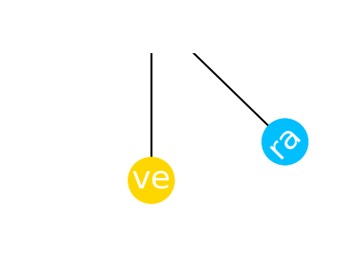
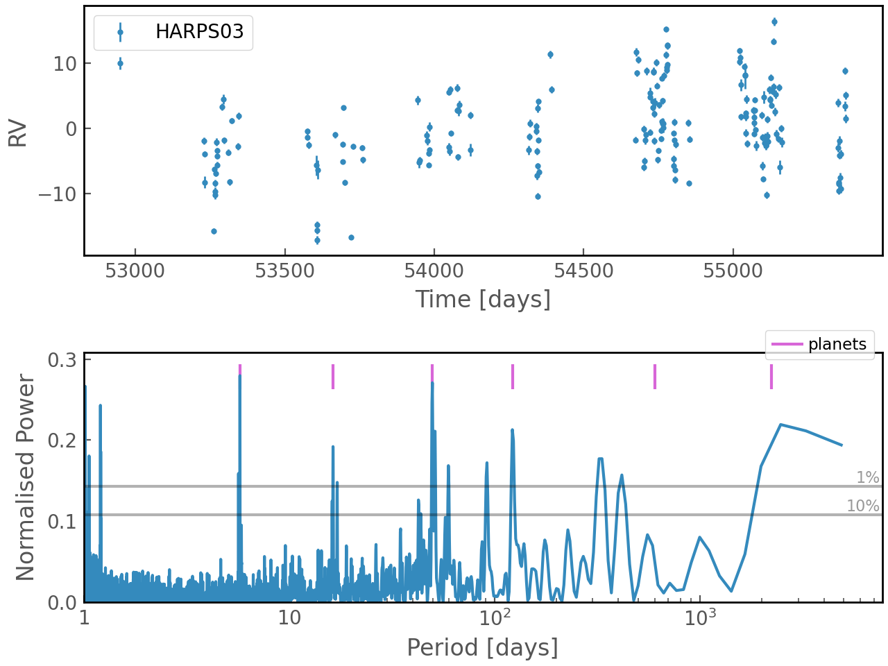

<div align="center">
</img>


[](https://pypi.org/project/verapy/)
[](https://github.com/j-faria/vera/actions/workflows/python-package.yml)
[](https://github.com/j-faria/vera/blob/main/LICENSE)
[](https://www.fct.pt/)

</div>


### Installation

```
pip install verapy
```

### Getting started

```python
from vera import RV

s = RV('data_file.rdb')

s.plot()
```

### Interfacing with DACE

```python
from vera import DACE

HD10180 = DACE.HD10180
HD10180.plot_and_gls()
```

</img>

